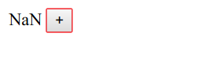

# state和setState 
* state 

用来存储可变化的状态。
```
constructor() {
        super();
        this.state = {isLiked:true}
    }
    handleClick(){
        this.setState(
        {isLiked:!this.state.isLiked}
        )
    }
    render() {
        return (
            <div>
                <button onClick={this.handleClick.bind(this)}>
                    {this.state.isLiked
                        ?"喜欢"
                        :"不喜欢"
                    }
                </button>
            </div>
        )
    }
```
* 状态更新过程

更新状态 

状态变化的过程 

1.在constructor中初始化 

this.state = {isLiked:true} 

2.在render中读取 
 
const {isLiked} = this.state; 

3.在函数中更新状态 

const liked = !this.state.isLiked; 

this.setState({liked});
 
 * setState 
 
调用这个函数的时候，React.js 会更新组件的状态 state ，并且重新调用 render 方法，然后再把 render 方法所渲染的最新的内容显示到页面上。
* setState接收参数 

调用setState函数后，并不是立即修改state．而是把对象放入队列之中，稍后才会从队列中把新的状态提取出来合并到state中

```

  handleClickOnLikeButton () {
    this.setState({ count: 0 }) // => this.state.count 还是 undefined
    this.setState({ count: this.state.count + 1}) // => undefined + 1 = NaN
    this.setState({ count: this.state.count + 2}) // => NaN + 2 = NaN
  }

```


解决办法:setState 的第二种使用方式，可以接受一个函数作为参数。
```
handleClickOnLikeButton () {
    this.setState((prevState) => {
      return { count: 0 }
    })
    this.setState((prevState) => {
      return { count: prevState.count + 1 } // 上一个 setState 的返回是 count 为 0，当前返回 1
    })
    this.setState((prevState) => {
      return { count: prevState.count + 2 } // 上一个 setState 的返回是 count 为 1，当前返回 3
    })
    // 最后的结果是 this.state.count 为 3
  }
```