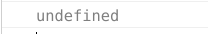

# React事件监听 
* 只需要给需要监听事件的元素加上属性类似于 onClick、onKeyDown 这样的属性
```angularjs
class App extends Component {
  handleClickOnTitle () {
    console.log('Click on title.')
  }

  render () {
    return (
      <h1 onClick={this.handleClickOnTitle}>React 小书</h1>
    )
  }
}
```
* event对象  

 React.js 中的 event 对象并不是浏览器提供的，而是它自己内部所构建的。用考虑不同浏览器的兼容性问题 
 
 * 事件中的this 
  
 第一个例子中，打印出的this为null或者undefined 
 
 原因: React.js 调用你所传给它的方法的时候，并不是通过对象方法的方式调用（this.handleClickOnTitle），而是直接通过函数调用 （handleClickOnTitle），所以事件监听函数内并不能通过 this 获取到实例。
```angularjs
 handleClick () {
    console.log(this) //undefined
  }

  render () {
    return (
      <h1 onClick={this.handleClick}>React 小书</h1>
    )
  }
```


* bind绑定 
```angularjs
 render () {
    return (
      <h1 onClick={this.handleClickOnTitle.bind(this)}>React 小书</h1>
    )
  }
```
手动 bind 到当前实例
